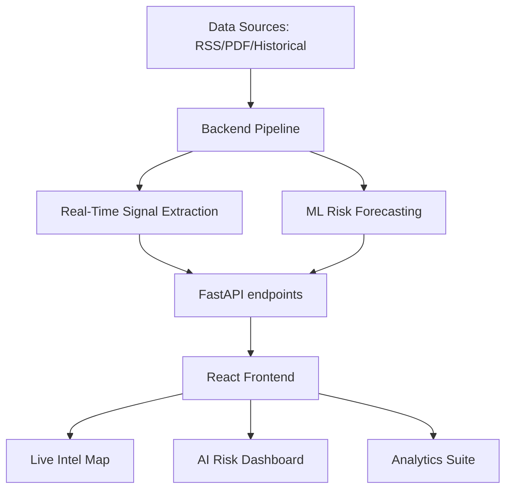

# 🛡️ SentinelGIS: Real-Time Epidemiological Intelligence & Surveillance

SentinelGIS is a next-generation surveillance and predictive mapping platform designed for proactive epidemiological monitoring. It bridges the gap between unstructured real-time intelligence (news, RSS, PDFs) and structured machine learning forecasts to provide health authorities with a comprehensive "Early Warning System."


## 🚀 Key Modules

### 📡 Live Intelligence Center
Real-time monitoring of epidemiological signals across India.
- **Dynamic Threat Mapping**: Interactive state-level visualization of active health hazards.
- **Signal Extraction**: Automated keyword-based disease detection (Nipah, Dengue, COVID-19, etc.) from RSS and Google News feeds.
- **Severity Scoring**: Color-coded risk indicators (Critical, High, Medium, Low) based on alert volume and disease type.

### 🔮 AI Risk Forecasting
Predictive modeling of disease spread using spatial-temporal algorithms.
- **District-Level Predictions**: Monthly risk forecasts (1-3 months ahead) for major infectious diseases.
- **Spatial Neighborhood Effects**: Incorporates "leading indicators" from adjacent districts to predict contagion patterns.
- **Verified Signals**: Cross-references ML forecasts with "News Verified" indicators from the Live Intel stream.

### 📊 Comprehensive Surveillance
- **Interactive Analytics**: Deep-dives into district level historical trends and anomaly detection.
- **Automated Data Pipeline**: Scrapers for IDSP (Integrated Disease Surveillance Programme) PDFs and global health RSS feeds.
- **Advanced Visualization**: High-performance mapping using Leaflet and responsive charts via Recharts.

## 🛠️ Tech Stack

- **Frontend**: React.js, Tailwind CSS, Framer Motion (Animations), React-Leaflet (GIS), Lucide Icons.
- **Backend**: FastAPI (Python), Uvicorn (ASGI Server).
- **ML/Science**: Scikit-Learn (Random Forest Spatial Models), Pandas, NumPy.
- **Data Enrichment**: BeautifulSoup4, GeoJSON state/district boundaries.

## 🏗️ Project Architecture



## ⚡ Quick Start

### Backend Setup
1. Navigate to the backend directory:
   ```bash
   cd backend
   ```
2. Install dependencies:
   ```bash
   pip install -r requirements.txt
   ```
3. Launch the server:
   ```bash
   uvicorn app.main:app --reload
   ```

### Frontend Setup
1. Navigate to the frontend directory:
   ```bash
   cd frontend
   ```
2. Install dependencies:
   ```bash
   npm install
   ```
3. Start the dev server:
   ```bash
   npm start
   ```

## 📂 Repository Structure

- `backend/app/routes/`: API endpoint definitions (Analytics, Predictions, Real-time).
- `backend/app/services/`: Core ML and processing logic.
- `backend/data/`: Data ingestion and cleaning scripts.
- `frontend/src/components/`: Reusable UI components including specialized GIS maps.
- `frontend/src/pages/`: Primary application dashboards.
- `frontend/public/data/`: High-resolution GeoJSON assets for India.

## 🤝 Contribution & License

SentinelGIS is built for public health resilience. For inquiries or collaboration, please refer to the project maintainers.

---
*Built with ❤️ for Global Health Security.*
